# Explicación del Código   
## Formulario Login

---

**Instrucciones para usar en VS Code:**
1. Instalar extensión "Marp for VS Code"
2. Abrir este archivo `.md`
3. Usar el comando "Marp: Open Preview"
4. Para exportar: "Marp: Export slide deck" (PDF, HTML, PPTX)
---
## 🧩 Estructura básica del documento

```html
<!DOCTYPE html>
<html lang="es">
<head>
  <!-- Metadatos -->
  <meta charset="UTF-8">
  <meta name="viewport" content="width=device-width, initial-scale=1.0">
  
  <!-- Estilos CSS -->
  <style>
    /* Estilos para el contenedor, formulario, inputs y botones */
  </style>
</head>
<body>
  <!-- Contenedor raíz para React -->
  <div id="root"></div>

  <!-- Librerías desde CDN -->
  <script src="https://unpkg.com/react@18/umd/react.development.js"></script>
  <script src="https://unpkg.com/react-dom@18/umd/react-dom.development.js"></script>
  <script src="https://unpkg.com/@babel/standalone/babel.min.js"></script>

  <!-- Código del componente -->
  <script type="text/babel">
    // Implementación del componente LoginForm
  </script>
</body>
</html>
```
---
## 🔧 Componente LoginForm
### Definición de la Clase y Estado Inicial
```js
class LoginForm extends React.Component {
  constructor(props) {
    super(props);
    this.state = {email: '', password: '',error:''
    };
  }
```
##### - Crea un componente de clase que hereda de React.Component.
##### - Inicializa el estado con tres propiedades:
  - email: El correo electrónico del usuario.
  - password: La contraseña del usuario.
  - error: Mensaje de error en caso de fallo.
---
### Manejo de Cambios en los Inputs
```js
handleChange = (e) => {
  this.setState({
    [e.target.name]: e.target.value,error: ''
  });
}
```
##### Inicializa el estado con tres propiedades:
  - Se ejecuta con cada tecla presionada en los inputs
  - e.target.name identifica qué input está cambiando (coincide con el atributo name del input)
  - e.target.value contiene el nuevo valor del input
   - Actualiza el estado y limpia cualquier error previo

---
### Envío y Validación del Formulario
```js
handleSubmit = (e) => {
  e.preventDefault();

  // Validación básica
  if (!this.state.email || !this.state.password) {
    this.setState({ error: 'Todos los campos son requeridos' });
    return;
  }
  // Simulación de envío
  console.log('Datos a enviar:', {
    email: this.state.email,
    password: this.state.password
  });
  alert(`Bienvenido, ${this.state.email}`);
}
```
---
##### Proceso de validación:
  - e.preventDefault() evita el envío tradicional del formulario
  - Verifica que ambos campos contengan valores
  - e.target.value contiene el nuevo valor del input
   - Si falta algún campo:
      -  Actualiza el estado con mensaje de error
     - Actualiza el estado con mensaje de error
      - Detiene el proceso con return
  - Si los campos están completos:
      - Simula el envío de los datos (console.log o alert)
      - Muestra un mensaje de bienvenida con los datos ingresados
---

### Ejemplo de uso en JSX:
```html
<input
  name="email"
  value={this.state.email}
  onChange={this.handleChange}
  placeholder="tu@email.com"
/>
```
---
### Renderizado del Componente (JSX)
```js
render() {
  return (
    <div className="login-container">
      <h2>Iniciar Sesión</h2>
      {/* Mensaje de error condicional */}
      {this.state.error && <div className="error">{this.state.error}</div>}
      <form onSubmit={this.handleSubmit}>
        <div className="form-group">
          <label>Correo electrónico:</label>
          <input
            type="email"
            name="email"
            value={this.state.email}
            onChange={this.handleChange}
            placeholder="tu@email.com"
          />
        </div>
        <div className="form-group">
          <label>Contraseña:</label>
          <input
            type="password"
            name="password"
            value={this.state.password}
            onChange={this.handleChange}
            placeholder="••••••••"
          />
        </div>
        <button type="submit">Ingresar</button>
      </form>
    </div>
  );
}
```
---

## 📚 Recursos internos - CSS

```html
  <link rel="stylesheet" href="../../../assets/css/login_2.css">
```


---

## 🧭 Estructura del JSX:

```js
const root = ReactDOM.createRoot(document.getElementById('root'));
root.render(<LoginForm />);
```

- `ReactDOM.createRoot`: crea un contenedor raíz para React
- `document.getElementById('root')`:  selecciona el div donde se montará la app
- `root.render`: renderiza nuestro componente principal <LoginForm>

---

## 📝 Estructura del JSX:

- Contenedor principal con clase CSS.
- Título del formulario
- Mensaje de error (sólo si existe)
- Formulario con:
  - Grupo para campo email (etiqueta + input)
  - Grupo para campo contraseña (etiqueta + input)
  - Botón de envío

---

## 📊 Diagrama de Flujo Completo




---

# ¡Gracias!

¿Preguntas?  
🤓
